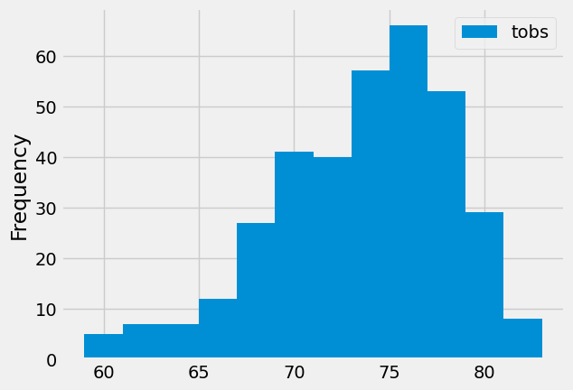

# sql-alchemy-challenge
Using Python and SQLAlchemy to do climate analysis and data exploration of a climate database.

## **Part 1: Analyze and Explore the Climate Data**

*Use Python and SQLAlchemy to do a basic climate analysis and data exploration of the climate database. Specifically,  use SQLAlchemy ORM queries, Pandas, and Matplotlib.*

### Precipitation Analysis

### Station Analysis

